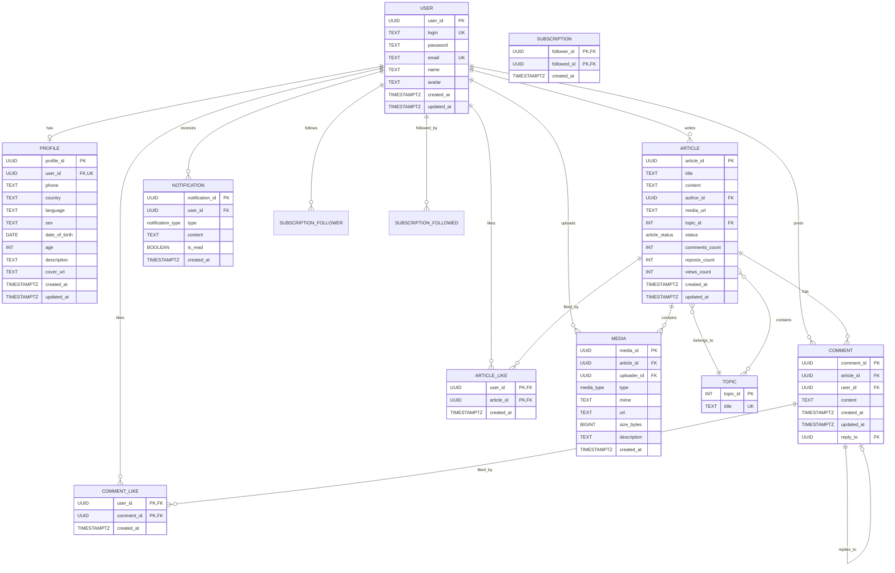

```mermaid
erDiagram
    USER ||--o| PROFILE : has
    USER ||--o{ ARTICLE : writes
    USER ||--o{ COMMENT : posts
    USER ||--o{ ARTICLE_LIKE : likes
    USER ||--o{ COMMENT_LIKE : likes
    USER ||--o{ NOTIFICATION : receives
    USER ||--o{ SUBSCRIPTION_FOLLOWER : follows
    USER ||--o{ SUBSCRIPTION_FOLLOWED : followed_by
    USER ||--o{ MEDIA : uploads

    ARTICLE ||--o{ COMMENT : has
    ARTICLE ||--o{ ARTICLE_LIKE : liked_by
    ARTICLE ||--o{ MEDIA : contains
    ARTICLE }o--|| TOPIC : belongs_to

    COMMENT ||--o{ COMMENT_LIKE : liked_by
    COMMENT ||--o| COMMENT : replies_to

    TOPIC }o--o{ ARTICLE : contains

    USER {
        UUID user_id PK
        TEXT login UK
        TEXT password
        TEXT email UK
        TEXT name
        TEXT avatar
        TIMESTAMPTZ created_at
        TIMESTAMPTZ updated_at
    }

    PROFILE {
        UUID profile_id PK
        UUID user_id FK,UK
        TEXT phone
        TEXT country
        TEXT language
        TEXT sex
        DATE date_of_birth
        INT age
        TEXT description
        TEXT cover_url
        TIMESTAMPTZ created_at
        TIMESTAMPTZ updated_at
    }

    ARTICLE {
        UUID article_id PK
        TEXT title
        TEXT content
        UUID author_id FK
        TEXT media_url
        INT topic_id FK
        article_status status
        INT comments_count
        INT reposts_count
        INT views_count
        TIMESTAMPTZ created_at
        TIMESTAMPTZ updated_at
    }

    TOPIC {
        INT topic_id PK
        TEXT title UK
    }

    COMMENT {
        UUID comment_id PK
        UUID article_id FK
        UUID user_id FK
        TEXT content
        TIMESTAMPTZ created_at
        TIMESTAMPTZ updated_at
        UUID reply_to FK
    }

    ARTICLE_LIKE {
        UUID user_id PK,FK
        UUID article_id PK,FK
        TIMESTAMPTZ created_at
    }

    COMMENT_LIKE {
        UUID user_id PK,FK
        UUID comment_id PK,FK
        TIMESTAMPTZ created_at
    }

    MEDIA {
        UUID media_id PK
        UUID article_id FK
        UUID uploader_id FK
        media_type type
        TEXT mime
        TEXT url
        BIGINT size_bytes
        TEXT description
        TIMESTAMPTZ created_at
    }

    SUBSCRIPTION {
        UUID follower_id PK,FK
        UUID followed_id PK,FK
        TIMESTAMPTZ created_at
    }

    NOTIFICATION {
        UUID notification_id PK
        UUID user_id FK
        notification_type type
        TEXT content
        BOOLEAN is_read
        TIMESTAMPTZ created_at
    }
```