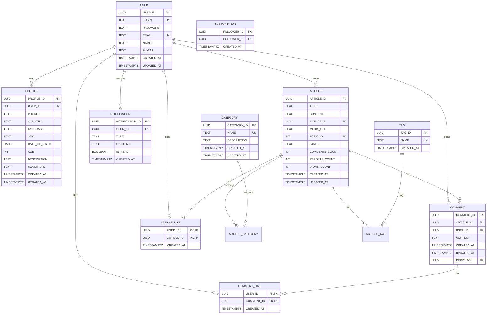

```mermaid
erDiagram
    USER ||--o{ PROFILE : has
    USER ||--o{ ARTICLE : writes
    USER ||--o{ COMMENT : posts
    USER ||--o{ ARTICLE_LIKE : likes
    USER ||--o{ COMMENT_LIKE : likes
    USER ||--o{ NOTIFICATION : receives
    ARTICLE ||--o{ COMMENT : has
    ARTICLE ||--o{ ARTICLE_CATEGORY : belongs
    ARTICLE ||--o{ ARTICLE_TAG : has
    ARTICLE ||--o{ ARTICLE_LIKE : has
    CATEGORY ||--o{ ARTICLE_CATEGORY : contains
    TAG ||--o{ ARTICLE_TAG : tags
    COMMENT ||--o{ COMMENT_LIKE : has

    USER {
        UUID USER_ID PK
        TEXT LOGIN UK
        TEXT PASSWORD
        TEXT EMAIL UK
        TEXT NAME
        TEXT AVATAR
        TIMESTAMPTZ CREATED_AT
        TIMESTAMPTZ UPDATED_AT
    }
    PROFILE {
        UUID PROFILE_ID PK
        UUID USER_ID FK
        TEXT PHONE
        TEXT COUNTRY
        TEXT LANGUAGE
        TEXT SEX
        DATE DATE_OF_BIRTH
        INT AGE
        TEXT DESCRIPTION
        TEXT COVER_URL
        TIMESTAMPTZ CREATED_AT
        TIMESTAMPTZ UPDATED_AT
    }
    ARTICLE {
        UUID ARTICLE_ID PK
        TEXT TITLE
        TEXT CONTENT
        UUID AUTHOR_ID FK
        TEXT MEDIA_URL
        INT TOPIC_ID FK
        TEXT STATUS
        INT COMMENTS_COUNT
        INT REPOSTS_COUNT
        INT VIEWS_COUNT
        TIMESTAMPTZ CREATED_AT
        TIMESTAMPTZ UPDATED_AT
    }
    CATEGORY {
        UUID CATEGORY_ID PK
        TEXT NAME UK
        TEXT DESCRIPTION
        TIMESTAMPTZ CREATED_AT
        TIMESTAMPTZ UPDATED_AT
    }
    TAG {
        UUID TAG_ID PK
        TEXT NAME UK
        TIMESTAMPTZ CREATED_AT
    }
    COMMENT {
        UUID COMMENT_ID PK
        UUID ARTICLE_ID FK
        UUID USER_ID FK
        TEXT CONTENT
        TIMESTAMPTZ CREATED_AT
        TIMESTAMPTZ UPDATED_AT
        UUID REPLY_TO FK
    }
    ARTICLE_LIKE {
        UUID USER_ID PK,FK
        UUID ARTICLE_ID PK,FK
        TIMESTAMPTZ CREATED_AT
    }
    COMMENT_LIKE {
        UUID USER_ID PK,FK
        UUID COMMENT_ID PK,FK
        TIMESTAMPTZ CREATED_AT
    }
    NOTIFICATION {
        UUID NOTIFICATION_ID PK
        UUID USER_ID FK
        TEXT TYPE
        TEXT CONTENT
        BOOLEAN IS_READ
        TIMESTAMPTZ CREATED_AT
    }
    SUBSCRIPTION {
        UUID FOLLOWER_ID FK
        UUID FOLLOWED_ID FK
        TIMESTAMPTZ CREATED_AT
    }
```